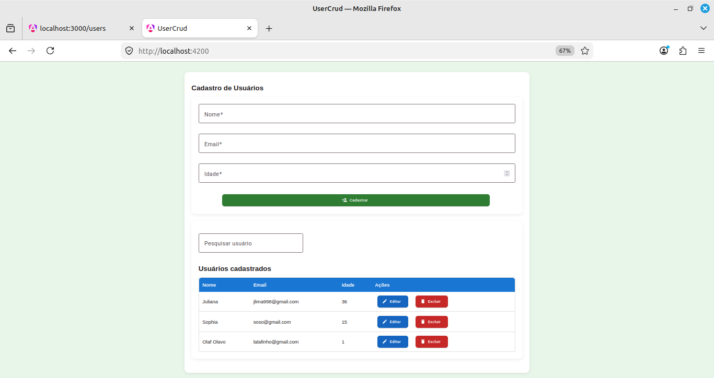
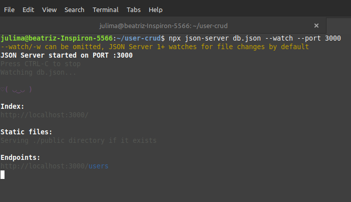
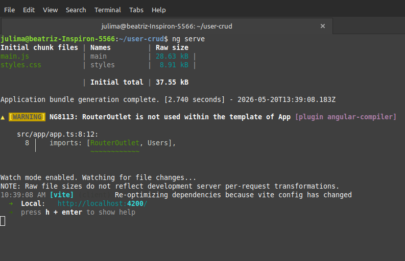

# CRUD de Usuários com Angular + Angular Material

## 📌 Sobre o projeto

Este projeto foi desenvolvido com o objetivo de praticar conceitos fundamentais de desenvolvimento frontend utilizando Angular.

A aplicação consiste em um sistema de cadastro de usuários com funcionalidades completas de CRUD:

- Criar usuários
- Listar usuários
- Editar usuários
- Excluir usuários
- Pesquisar usuários em tempo real

Além das funcionalidades, o projeto também recebeu melhorias visuais utilizando Angular Material para criar uma interface mais moderna e amigável.

---

# 🚀 Tecnologias utilizadas

- Angular
- TypeScript
- Angular Material
- RxJS
- JSON Server
- HTML
- CSS

---

# 🎯 Funcionalidades

## ✅ Cadastro de usuários
Permite cadastrar usuários com:
- Nome
- Email
- Idade

---

## ✅ Validação de formulário
Validações implementadas:

- Nome obrigatório
- Nome com mínimo de 3 caracteres
- Email válido
- Idade mínima e máxima

Mensagens de erro são exibidas em tempo real.

---

## ✅ Atualização de usuários
Permite editar usuários já cadastrados.

O formulário é preenchido automaticamente ao clicar em editar.

---

## ✅ Exclusão de usuários
Permite remover usuários da lista.

---

## ✅ Busca em tempo real
Filtro de pesquisa por:
- Nome
- Email

---

## ✅ Interface moderna
O projeto utiliza Angular Material para:

- Inputs estilizados
- Botões personalizados
- Ícones
- Snackbar de sucesso
- Layout moderno

---

# 🖥️ Preview da aplicação

## Tela de cadastro
- Formulário moderno
- Campos validados
- Feedback visual

## Lista de usuários
- Tabela estilizada
- Ações de editar e excluir
- Pesquisa dinâmica





---

# 📂 Estrutura do projeto

```bash
src/
 ├── app/
 │   ├── services/
 │   │   └── user.ts
 │   ├── users/
 │   │   ├── users.ts
 │   │   ├── users.html
 │   │   └── users.css
 │   ├── app.ts
 │   └── app.html
```

---

# ⚙️ Como executar o projeto

## 1️⃣ Clonar repositório

```bash
git clone https://github.com/JuhLima89/desafio-angular-crud.git
```

---

## 2️⃣ Entrar na pasta

```bash
cd user-crud
```

---

## 3️⃣ Instalar dependências

```bash
npm install
```

---

## 4️⃣ Rodar o JSON Server

```bash
npx json-server --watch db.json
```




Servidor backend:

```bash
http://localhost:3000/users
```

---

## 5️⃣ Rodar aplicação Angular

```bash
ng serve
```




Aplicação disponível em:

```bash
http://localhost:4200
```

## 📄 Exemplo de dados mockados

```json
{
  "users": [
    {
      "id": "1",
      "name": "Juliana",
      "email": "julima@email.com",
      "age": 36
    }
  ]
}
```

---

# 📚 Aprendizados

Durante o desenvolvimento deste projeto foram praticados:

- Componentes standalone
- Reactive Forms
- Consumo de API
- Observables
- Services
- CRUD completo
- Angular Material
- Estruturação de projeto Angular
- Estilização e UX
- Debug de erros Angular/TypeScript

---

# 👩‍💻 Desenvolvido por

Juliana Lima

